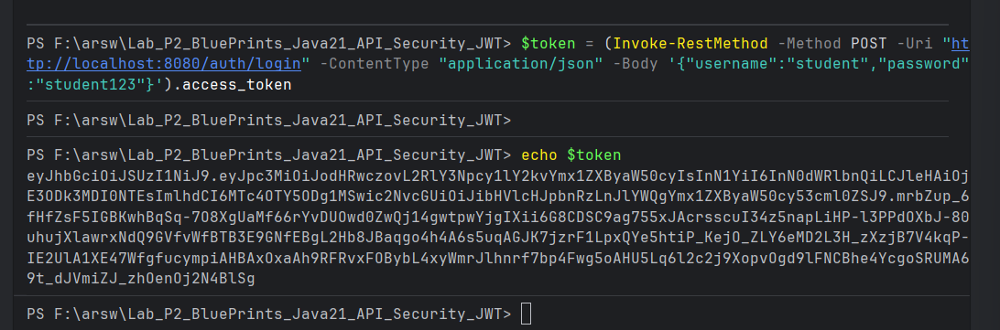
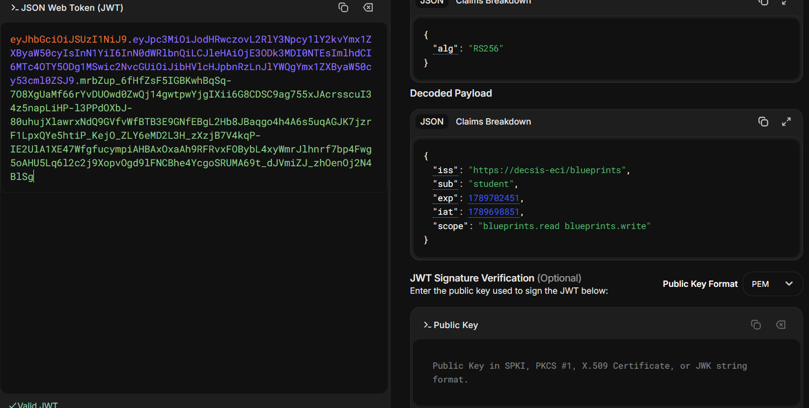
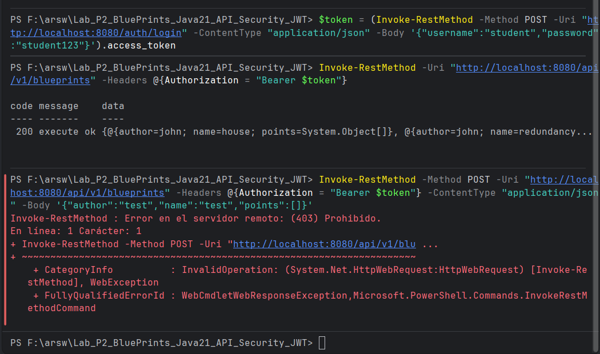
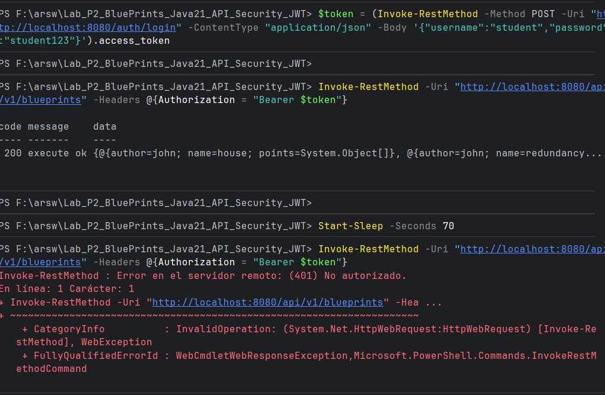
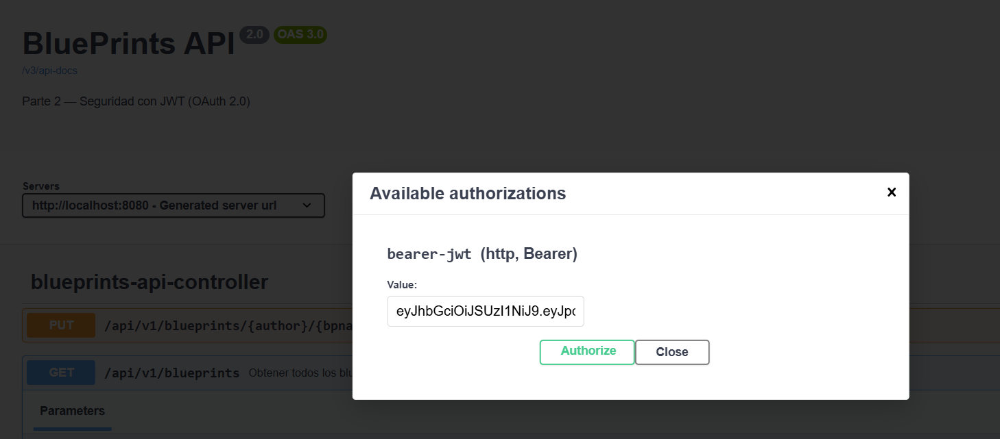
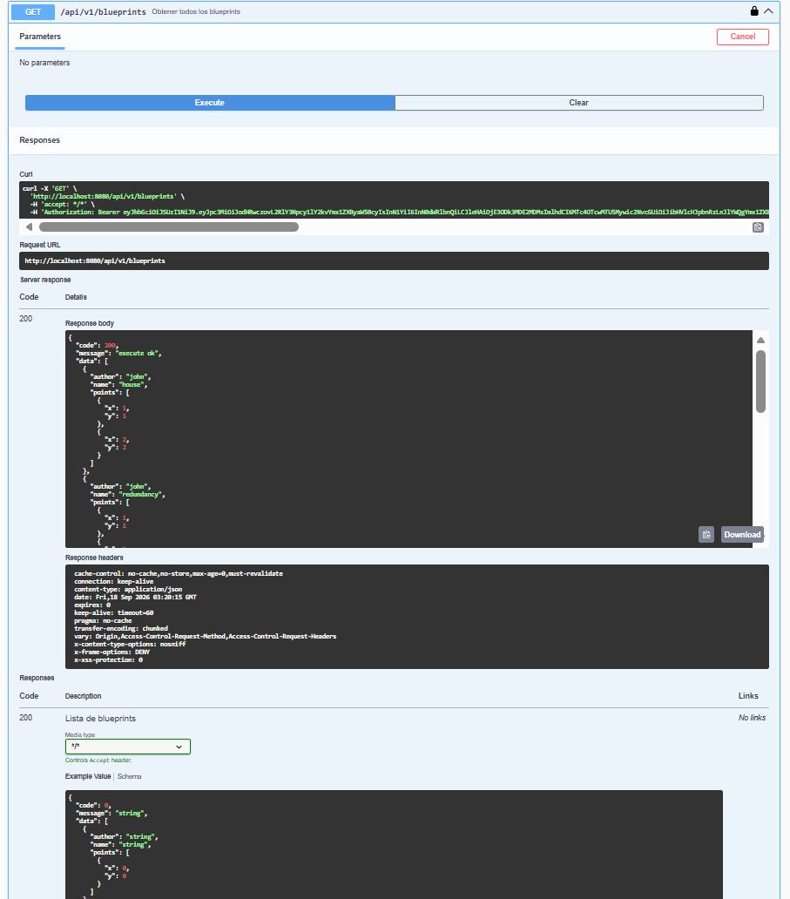

# Escuela Colombiana de Ingeniería Julio Garavito
## Arquitectura de Software – ARSW
### Laboratorio – Parte 2: BluePrints API con Seguridad JWT (OAuth 2.0)

Este laboratorio extiende la **Parte 1** ([Lab_P1_BluePrints_Java21_API](https://github.com/DECSIS-ECI/Lab_P1_BluePrints_Java21_API)) agregando **seguridad a la API** usando **Spring Boot 3, Java 21 y JWT (OAuth 2.0)**.  
El API se convierte en un **Resource Server** protegido por tokens Bearer firmados con **RS256**.  
Incluye un endpoint didáctico `/auth/login` que emite el token para facilitar las pruebas.

---

## Objetivos
- Implementar seguridad en servicios REST usando **OAuth2 Resource Server**.
- Configurar emisión y validación de **JWT**.
- Proteger endpoints con **roles y scopes** (`blueprints.read`, `blueprints.write`).
- Integrar la documentación de seguridad en **Swagger/OpenAPI**.

---

## Requisitos
- JDK 21
- Maven 3.9+
- Git
- PostgreSQL (o Docker con imagen `postgres:16`)

---

## Ejecución del proyecto

1. Clonar el repositorio:
   ```bash
   git clone https://github.com/DECSIS-ECI/Lab_P2_BluePrints_Java21_API_Security_JWT.git
   cd Lab_P2_BluePrints_Java21_API_Security_JWT
   ```

2. Levantar la base de datos con Docker:
   ```bash
   docker run --name blueprints-db -e POSTGRES_DB=blueprints -e POSTGRES_USER=<usuario> -e POSTGRES_PASSWORD=<password> -p 5432:5432 -d postgres:16
   ```

3. Ajustar las credenciales en `src/main/resources/application.yml`:
   ```yaml
   spring:
     datasource:
       url: jdbc:postgresql://localhost:5432/blueprints
       username: <usuario>
       password: <password>
   ```

4. Ejecutar con Maven:
   ```bash
   mvn -q -DskipTests spring-boot:run
   ```

5. Verificar que la aplicación levante en `http://localhost:8080`.

---

## Endpoints principales

### 1. Login (emite token)
```
POST http://localhost:8080/auth/login
Content-Type: application/json

{
  "username": "student",
  "password": "student123"
}
```
Respuesta:
```json
{
  "access_token": "eyJhbGciOiJSUzI1NiIsInR5cCI6IkpXVCJ9...",
  "token_type": "Bearer",
  "expires_in": 3600
}
```

### 2. Consultar todos los blueprints (requiere scope `blueprints.read`)
```
GET http://localhost:8080/api/v1/blueprints
Authorization: Bearer <ACCESS_TOKEN>
```

### 3. Consultar blueprints por autor (requiere scope `blueprints.read`)
```
GET http://localhost:8080/api/v1/blueprints/{author}
Authorization: Bearer <ACCESS_TOKEN>
```

### 4. Consultar blueprint por autor y nombre (requiere scope `blueprints.read`)
```
GET http://localhost:8080/api/v1/blueprints/{author}/{bpname}
Authorization: Bearer <ACCESS_TOKEN>
```

### 5. Crear blueprint (requiere scope `blueprints.write`)
```
POST http://localhost:8080/api/v1/blueprints
Authorization: Bearer <ACCESS_TOKEN>
Content-Type: application/json

{
  "author": "juan",
  "name": "Nuevo Plano",
  "points": [{"x": 0, "y": 0}, {"x": 10, "y": 10}]
}
```

### 6. Agregar punto a un blueprint (requiere scope `blueprints.write`)
```
PUT http://localhost:8080/api/v1/blueprints/{author}/{bpname}/points
Authorization: Bearer <ACCESS_TOKEN>
Content-Type: application/json

{"x": 5, "y": 5}
```

---

## Swagger UI
- URL: [http://localhost:8080/swagger-ui/index.html](http://localhost:8080/swagger-ui/index.html)
- Pulsa **Authorize** e ingresa el token en el formato:
  ```
  Bearer eyJhbGciOi...
  ```

---

## Estructura del proyecto
```
src/main/java/co/edu/eci/blueprints/
  ├── BlueprintsApiApplication.java
  ├── auth/
  │    └── AuthController.java           # Login didáctico para emitir tokens
  ├── config/
  │    └── OpenApiConfig.java            # Configuración Swagger + JWT
  ├── controllers/
  │    ├── BlueprintsAPIController.java  # Endpoints reales de blueprints
  │    └── RestResponse.java
  ├── filters/
  │    ├── BlueprintsFilter.java
  │    ├── IdentityFilter.java
  │    ├── RedundancyFilter.java
  │    └── UndersamplingFilter.java
  ├── model/
  │    ├── Blueprint.java
  │    ├── BlueprintId.java
  │    └── Point.java
  ├── persistence/
  │    ├── BlueprintPersistence.java
  │    ├── expt/
  │    │    ├── BlueprintNotFoundException.java
  │    │    └── BlueprintPersistenceException.java
  │    └── impl/
  │         ├── BlueprintRepository.java
  │         ├── InMemoryBlueprintPersistence.java
  │         └── PostgresBlueprintPersistence.java
  ├── security/
  │    ├── SecurityConfig.java
  │    ├── MethodSecurityConfig.java
  │    ├── JwtKeyProvider.java
  │    ├── InMemoryUserService.java
  │    └── RsaKeyProperties.java
  └── services/
       └── BlueprintsServices.java
src/main/resources/
  └── application.yml
```

---

## Actividades propuestas
1. Revisar el código de configuración de seguridad (`SecurityConfig`) e identificar cómo se definen los endpoints públicos y protegidos.
2. Explorar el flujo de login y analizar las claims del JWT emitido.
3. Extender los scopes (`blueprints.read`, `blueprints.write`) para controlar otros endpoints de la API, del laboratorio P1 trabajado.
4. Modificar el tiempo de expiración del token y observar el efecto.
5. Documentar en Swagger los endpoints de autenticación y de negocio.

---

## Desarrollo

### Fusión Lab P1 → Lab P2

Este fork parte del código base del **Lab P2** (seguridad JWT) e integra la lógica completa del **Lab P1** (blueprints reales). A continuación se describen los cambios realizados:

**1. `pom.xml` — Agregar dependencias de JPA y PostgreSQL**

Se agregaron las dependencias que el P1 tenía y el P2 no:
```xml
<dependency>
  <groupId>org.springframework.boot</groupId>
  <artifactId>spring-boot-starter-data-jpa</artifactId>
</dependency>
<dependency>
  <groupId>org.postgresql</groupId>
  <artifactId>postgresql</artifactId>
  <scope>runtime</scope>
</dependency>
```

**2. `application.yml` — Agregar configuración de base de datos**

Se añadió el bloque de datasource y JPA al YAML existente del P2:
```yaml
spring:
  datasource:
    url: jdbc:postgresql://localhost:5432/blueprints
    username: <usuario>
    password: <password>
  jpa:
    hibernate:
      ddl-auto: update
    show-sql: true
```

**3. Copiar paquetes del P1 al P2**

Se copiaron las siguientes carpetas desde `edu.eci.arsw.blueprints` hacia `co.edu.eci.blueprints`, actualizando la declaración de `package` e `imports` en cada archivo:

| Carpeta | Contenido |
|---|---|
| `model/` | `Blueprint`, `BlueprintId`, `Point` |
| `persistence/` | Interfaz `BlueprintPersistence`, excepciones, `InMemoryBlueprintPersistence`, `PostgresBlueprintPersistence`, `BlueprintRepository` |
| `filters/` | `BlueprintsFilter`, `IdentityFilter`, `RedundancyFilter`, `UndersamplingFilter` |
| `services/` | `BlueprintsServices` |
| `controllers/` | `BlueprintsAPIController`, `RestResponse` |

**4. `SecurityConfig.java` — Ajustar ruta protegida**

Se actualizó la ruta del `requestMatchers` para que coincida con el path real del controlador del P1:
```java
// Antes (P2 original):
.requestMatchers("/api/**")

// Después (fusionado):
.requestMatchers("/api/v1/blueprints/**")
```

**5. `BlueprintsAPIController.java` — Agregar `@PreAuthorize`**

Se anotaron los métodos del controlador con los scopes correspondientes:
```java
// Métodos GET:
@PreAuthorize("hasAuthority('SCOPE_blueprints.read')")

// Métodos POST y PUT:
@PreAuthorize("hasAuthority('SCOPE_blueprints.write')")
```

**6. Eliminar controlador de prueba del P2**

Se eliminó `src/main/java/co/edu/eci/blueprints/api/BlueprintController.java`, que contenía datos hardcodeados y fue reemplazado por el controlador real del P1.

---

### Actividad 1 -Endpoint públicos vs protegidos

Se analizó la clase `SecurityConfig.java` para identificar las reglas de acceso HTTP definidas
en el método `filterChain`. Se identificaron los endpoints públicos (`/auth/login`,
`/actuator/health`, `/swagger-ui/**`, `/v3/api-docs/**`) y el endpoint protegido (`/api/v1/blueprints/**`),
que requiere un token JWT con scope `blueprints.read` p  `blueprints.write`. Se deshabilitó CSRF
ya que la API usa JWT y no sesiones de navegador.


### Actividad 2 — Analizar las claims del JWT

Se obtuvo un token JWT haciendo login con el usuario `student` mediante el endpoint `/auth/login`:



El token fue decodificado en [jwt.io](https://jwt.io) para analizar su contenido:



El payload contiene las siguientes claims:

| Claim | Valor | Descripción |
|---|---|---|
| `iss` | `https://decsis-eci/blueprints` | Quién emitió el token |
| `sub` | `student` | Usuario al que pertenece |
| `iat` | timestamp | Fecha de emisión |
| `exp` | timestamp | Fecha de expiración (iat + 3600s) |
| `scope` | `blueprints.read blueprints.write` | Permisos del token |

## Actividad 3 — Extender scopes para controlar endpoints

Se verificó el control de acceso fino mediante scopes en los endpoints del controlador `BlueprintsAPIController.java`. Los métodos GET requieren `SCOPE_blueprints.read` y los métodos POST y PUT requieren `SCOPE_blueprints.write`.

Para probarlo, se modificó temporalmente el `AuthController.java` para emitir tokens con solo `blueprints.read` y se verificó que:

- `GET /api/v1/blueprints` → `200 OK` 
- `POST /api/v1/blueprints` → `403 Forbidden` 



## Actividad 4 — Modificar el TTL del token

Se cambió `token-ttl-seconds` a `10` segundos en `application.yml` y se verificó el comportamiento:

- Uso inmediato del token → `200 OK` 
- Uso después de 70 segundos → `401 Unauthorized` 

> Nota: Spring aplica un clock skew de 60 segundos por defecto, por lo que el token
> efectivamente expira a los `ttl + 60` segundos. Se usó un sleep de 70s para superarlo.



## Actividad 5 — Documentar en Swagger

Se verificó la documentación de la API en Swagger UI (`http://localhost:8080/swagger-ui/index.html`).
Todos los endpoints aparecen documentados con sus descripciones y el candado 🔒 indicando
que requieren autenticación. Se probó el flujo completo desde Swagger:

1. Obtener el token desde `/auth/login`
2. Pegarlo en el botón **Authorize** con el esquema `bearer-jwt`



3. Ejecutar `GET /api/v1/blueprints` exitosamente con `200 OK`




---

## Lecturas recomendadas
- [Spring Security Reference – OAuth2 Resource Server](https://docs.spring.io/spring-security/reference/servlet/oauth2/resource-server/index.html)
- [Spring Boot – Securing Web Applications](https://spring.io/guides/gs/securing-web/)
- [JSON Web Tokens – jwt.io](https://jwt.io/introduction)

---

## Licencia
Proyecto educativo con fines académicos – Escuela Colombiana de Ingeniería Julio Garavito.